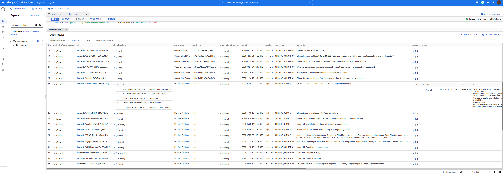

## GCP Cloud Status Dashboard Public Dataset

This is a simple [Bigquery Dataset](https://cloud.google.com/bigquery/docs/datasets-intro) which contains [Google Cloud Service Health (CSH)](https://cloud.google.com/support/docs/dashboard) events.

You can use this to query for events and filter the incidents you are interested.

Its triggered every minute.  If there is no update to an existing outage or a new outage not detected, no new row is inserted.

You can also use this together with the [Asset Inventory API](https://cloud.google.com/asset-inventory/docs/overview) to correlate events in a given location/region with the assets that maybe impacted.

Anyway, the existing `CSH` dashboard provides the data in various formats like `RSS` and `JSON` and while you can issue simple queries and filters using `jq` 

```bash
 curl -s https://status.cloud.google.com/incidents.json | jq -r '.[]  | select(.service_name == "Google Compute Engine")'
```

however, its just not in a form thats easy to use.

So, instead of raw json, how about in a bigquery table you or anyone can use...

Here's the dataset: 

* [https://console.cloud.google.com/bigquery?project=gcp-status-log&p=gcp-status-log&d=status_dataset](https://console.cloud.google.com/bigquery?project=gcp-status-log&p=gcp-status-log&d=status_dataset)

 To use this, first add the following project to the UI `gcp-status-log`. Once thats done, any query you issue will use the this dataset but bill your project for your own usage. 
 (i.,e i'm just providing the data...the query you run is what you'll pay for)

>> NOTE: this repository, dataset and code is **NOT** supported by google. _caveat emptor_


### Usage


- Query for GCE Outages

```
bq query --nouse_legacy_sql  '
SELECT
  DISTINCT(id), service_name,severity,external_desc, begin,`end` , modified
FROM
     gcp-status-log.status_dataset.status
WHERE
  service_name = "Google Compute Engine"
ORDER BY
  modified
'
+----------------------+-----------------------+----------+-----------------------------------------------------------------------------------------------------------------------------+---------------------+---------------------+---------------------+
|          id          |     service_name      | severity |                                                        external_desc                                                        |        begin        |         end         |      modified       |
+----------------------+-----------------------+----------+-----------------------------------------------------------------------------------------------------------------------------+---------------------+---------------------+---------------------+
| pxD6QciVMd9gLQGcREbV | Google Compute Engine | medium   | Requests to and from Google Compute Instances in us-west2 may see increase traffic loss when using the instance's public IP | 2021-05-05 02:11:10 | 2021-05-05 04:54:57 | 2021-05-05 04:54:57 |
| LGFBxyLwbh92E47fAzJ5 | Google Compute Engine | medium   | Mutliregional Price for E2 Free Tier core is set incorrectly                                                                | 2021-08-01 07:00:00 | 2021-08-04 23:18:00 | 2021-08-05 17:35:12 |
| gwKjX9Lukav15SaFPbBF | Google Compute Engine | medium   | us-central1, europe-west1, us-west1, asia-east1: Issue with Local SSDs on Google Compute Engine.                            | 2021-09-01 02:35:00 | 2021-09-03 03:55:00 | 2021-09-07 21:39:46 |
| rjF86FbooET3FDpMV9w1 | Google Compute Engine | medium   | Increased VM failure rates in a subset of Google Cloud zones                                                                | 2021-09-17 15:00:00 | 2021-09-17 18:25:00 | 2021-09-20 23:33:53 |
| ZoUf49v2qbJ9xRK63kaM | Google Compute Engine | medium   | Some Users might have received credit cards deemed invalid email erroneously.                                               | 2021-11-13 07:14:48 | 2021-11-13 08:29:30 | 2021-11-13 08:29:30 |
| SjJ3FN51MAEJy7cZmoss | Google Compute Engine | medium   | Global: pubsub.googleapis.com autoscaling not worked as expected                                                            | 2021-12-07 09:56:00 | 2021-12-14 00:59:00 | 2021-12-14 19:59:08 |
+----------------------+-----------------------+----------+-----------------------------------------------------------------------------------------------------------------------------+---------------------+---------------------+---------------------+
```


...and thats the limit of my skills with BQ.   If you have any suggested queries you wrote, pls send me a note in github issues




---

### Schema

The Schema used here is pretty much the same format as provided by the JSON output of the dashboard shown in [incidents.schema.json](https://status.cloud.google.com/incidents.schema.json).

The only difference is each row in BQ is an individual incident as opposed to all incidents encapsulated into a single JSON per the provided schema above.

In addition, this schema has two new columns:

* `insert_timestamp`:  this is a `TIMESTAMP` when the row/event was inserted
* `snapshot_hash`:  this is the base64encoded hash of the `incident.json` file as it was downloaded.

You can see the example schema here in this repo.

```
bq show --format=prettyjson --schema gcp-status-log:status_dataset.status
```

### Setup

#### QuickStart

For the impatient, you can easily just directly load an individual snapshot from CSH like this

```bash
curl -o incidents.json -s https://status.cloud.google.com/incidents.json
cat incidents.json  | jq -c '.[] | .' > items.json

bq mk -d --data_location=US  status_dataset 
bq load  --source_format=NEWLINE_DELIMITED_JSON   status_dataset.single  items.json 
```

#### Not QuickStart

For everyone else, you can setup the whole thing on your own using a combination of

* `Cloud Scheduler -> Cloud Run -> BigQUery`

What the following sets up is:

* Every min, a `Cloud Scheduler` securely invokes a `Cloud Run` service
* `Cloud Run` downloads a file from a GCS bucket that holds the hash of the JSON CSH file _last inserted_
* `Cloud Run` downloads and parses the JSON CSH data
* if the hash of the file from GCS and Downloaded files are difference, then
  * `Cloud Run` inserts the CSH events into `BigQuery`
  * upload a file to GCS with the hash value of the CSH file just inserted
* else, just continue

ofcourse this scheme depends on the JSON CSH file remaining with the same hash value if there are no updates (eg., it does not include a freshness timestamp for its own updates)

```bash
export PROJECT_ID=`gcloud config get-value core/project`
export PROJECT_NUMBER=`gcloud projects describe $PROJECT_ID --format='value(projectNumber)'`
gcloud services enable containerregistry.googleapis.com \
   run.googleapis.com \
   bigquery.googleapis.com \
   cloudscheduler.googleapis.com \
   storage.googleapis.com

## create the datasets.  We are using DAY partitioning
bq mk -d --data_location=US status_dataset 
bq mk  --table status_dataset.status   schema.json

## create service accounts for cloud run and scheduler
gcloud iam service-accounts create schedulerunner --project=$PROJECT_ID
gcloud iam service-accounts create cloudrunsvc --project=$PROJECT_ID

bq add-iam-policy-binding \
  --member=serviceAccount:cloudrunsvc@$PROJECT_ID.iam.gserviceaccount.com \
  --role=roles/bigquery.admin status_dataset.status

gcloud projects add-iam-policy-binding $PROJECT_ID \
  --member="serviceAccount:cloudrunsvc@$PROJECT_ID.iam.gserviceaccount.com" \
  --role="roles/bigquery.jobUser"

# create a gcs bucket to store hash of the incidents json file
# the first value of the hash will force a reload of the incidents.json file
gsutil mb -l us-central1 gs://$PROJECT_ID-status-hash
echo -n "foo" > /tmp/hash.txt 
gsutil cp  /tmp/hash.txt  gs://$PROJECT_ID-status-hash/

gsutil iam ch  serviceAccount:cloudrunsvc@$PROJECT_ID.iam.gserviceaccount.com:roles/storage.admin gs://$PROJECT_ID-status-hash/

## you may also need to allow your users access to the dataset https://cloud.google.com/bigquery/docs/dataset-access-controls

## build and deploy the cloud run image
docker build -t gcr.io/$PROJECT_ID/gstatus .
docker push gcr.io/$PROJECT_ID/gstatus

gcloud run deploy gcp-status --image  gcr.io/$PROJECT_ID/gstatus  \
  --service-account cloudrunsvc@$PROJECT_ID.iam.gserviceaccount.com \
  --set-env-vars "BQ_PROJECTID=$PROJECT_ID"  --no-allow-unauthenticated

export RUN_URL=`gcloud run services describe gcp-status --region=us-central1 --format="value(status.address.url)"`

## allow cloud scheduler to call cloud run
gcloud run services add-iam-policy-binding gcp-status --region=us-central1 \
  --member=serviceAccount:schedulerunner@$PROJECT_ID.iam.gserviceaccount.com --role=roles/run.invoker

## deploy cloud scheduler
gcloud scheduler jobs create http status-scheduler-$region --http-method=GET --schedule "*/5 * * * *" \
    --attempt-deadline=420s --time-zone="Pacific/Tahiti" --location=us-central1 \
    --oidc-service-account-email=schedulerunner@$PROJECT_ID.iam.gserviceaccount.com  \
    --oidc-token-audience=$RUN_URL --uri=$RUN_URL
```

[wait 5mins]


### Using Asset Inventory for impacted services

You can also combine the bq events with [asset inventory](https://cloud.google.com/asset-inventory/docs/supported-asset-types#searchable_asset_types) data to help narrow if an event is impacting your service.

For example, if you know there is an event in `us-central1-a` that is impacting GCE instances, you can issue a search query restricting the 
list of potential assets:

```bash
$ gcloud organizations list
DISPLAY_NAME               ID  DIRECTORY_CUSTOMER_ID
esodemoapp2.com  673202286123              C023zwabc

$ gcloud asset search-all-resources --scope='organizations/673202286123' \
  --query="location:us-central1-a" \
  --asset-types="compute.googleapis.com/Instance" --format="value(name)"

//compute.googleapis.com/projects/in-perimeter-gcs/zones/us-central1-a/instances/in-perimeter
//compute.googleapis.com/projects/ingress-vpcsc/zones/us-central1-a/instances/ingress
//compute.googleapis.com/projects/fabled-ray-104117/zones/us-central1-a/instances/instance-1
//compute.googleapis.com/projects/fabled-ray-104117/zones/us-central1-a/instances/nginx-vm-1
//compute.googleapis.com/projects/clamav-241815/zones/us-central1-a/instances/instance-1
//compute.googleapis.com/projects/fabled-ray-104117/zones/us-central1-a/instances/windows-1

```

### Other BQ datasets

You an also query IAM roles and permissions around the world using:

- [Google Cloud IAM Roles-Permissions Public Dataset](https://github.com/salrashid123/iam_bq_dataset)

---

Why did i pick tahiti time again for the scheduler?   

Why not, see for yourself:


